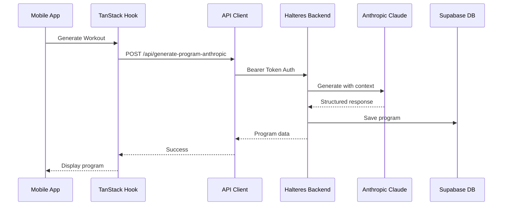

# Anthropic Claude API Integration Guide

This document outlines the integration patterns for using Anthropic's Claude API in the Halteres mobile application.

## Architecture Overview



## Core Implementation

### 1. API Client Setup

```typescript
// lib/api/ai.ts
import { apiClient } from './client'
import type { Program, Entity } from '@/types/database'

interface GenerateWorkoutParams {
  entity_id: string
  duration_weeks: number
  training_methodology: 'BODYBUILDING' | 'POWERLIFTING' | 'CROSSFIT' | 'HYBRID'
  goal: 'STRENGTH' | 'MUSCLE' | 'ENDURANCE' | 'WEIGHT_LOSS' | 'ATHLETIC'
  difficulty: 'BEGINNER' | 'INTERMEDIATE' | 'ADVANCED'
  equipment_available: string[]
  training_days: number
  session_duration: number // in minutes
  reference_workouts?: string[] // IDs of external workouts to use as reference
}

interface GenerateResponse {
  program: Program
  workouts: ProgramWorkout[]
  recommendations: AIRecommendation[]
}

export const aiApi = {
  generateProgram: (params: GenerateWorkoutParams) =>
    apiClient.post<GenerateResponse>('/api/generate-program-anthropic', params),

  regenerateWorkout: (workoutId: string, reason: string) =>
    apiClient.post<ProgramWorkout>('/api/regenerate-workout', {
      workout_id: workoutId,
      reason
    }),

  getRecommendations: (programId: string) =>
    apiClient.get<AIRecommendation[]>(`/api/programs/${programId}/recommendations`),

  adjustIntensity: (programId: string, adjustment: 'increase' | 'decrease', percentage: number) =>
    apiClient.post<Program>('/api/programs/${programId}/adjust-intensity', {
      adjustment,
      percentage
    })
}
```

### 2. TanStack Query Hooks

```typescript
// hooks/useAI.ts
import { useMutation, useQuery, useQueryClient } from '@tanstack/react-query'
import { aiApi } from '@/lib/api/ai'
import { useToast } from '@/components/ui/use-toast'

export function useGenerateProgram() {
  const queryClient = useQueryClient()
  const { toast } = useToast()

  return useMutation({
    mutationFn: aiApi.generateProgram,
    onSuccess: (data) => {
      // Invalidate programs list
      queryClient.invalidateQueries({ queryKey: ['programs'] })

      // Add new program to cache
      queryClient.setQueryData(['program', data.program.id], data.program)

      // Cache workouts
      data.workouts.forEach(workout => {
        queryClient.setQueryData(['workout', workout.id], workout)
      })

      toast({
        title: 'Program Generated!',
        description: `Your ${data.program.duration_weeks}-week program is ready.`,
      })
    },
    onError: (error) => {
      toast({
        title: 'Generation Failed',
        description: error.message || 'Failed to generate program. Please try again.',
        variant: 'destructive',
      })
    },
    // Long timeout for AI generation
    meta: {
      timeout: 300000, // 5 minutes
    },
  })
}

export function useRegenerateWorkout() {
  const queryClient = useQueryClient()

  return useMutation({
    mutationFn: ({ workoutId, reason }: { workoutId: string; reason: string }) =>
      aiApi.regenerateWorkout(workoutId, reason),
    onSuccess: (data, variables) => {
      // Update specific workout in cache
      queryClient.setQueryData(['workout', variables.workoutId], data)

      // Invalidate program workouts
      queryClient.invalidateQueries({
        queryKey: ['program-workouts'],
        exact: false
      })
    },
  })
}

export function useAIRecommendations(programId: string) {
  return useQuery({
    queryKey: ['ai-recommendations', programId],
    queryFn: () => aiApi.getRecommendations(programId),
    enabled: !!programId,
    staleTime: 1000 * 60 * 60, // 1 hour
  })
}
```

### 3. Component Implementation

```typescript
// components/GenerateProgram.tsx
'use client'

import { useState } from 'react'
import { useForm } from 'react-hook-form'
import { zodResolver } from '@hookform/resolvers/zod'
import { z } from 'zod'
import { useGenerateProgram } from '@/hooks/useAI'
import { useEntity } from '@/hooks/useEntities'
import { Button } from '@/components/ui/button'
import { Card } from '@/components/ui/card'
import { Form, FormField, FormItem, FormLabel, FormControl } from '@/components/ui/form'
import { Select, SelectContent, SelectItem, SelectTrigger, SelectValue } from '@/components/ui/select'
import { Slider } from '@/components/ui/slider'
import { motion, AnimatePresence } from 'framer-motion'
import { Loader2, Sparkles } from 'lucide-react'

const generateSchema = z.object({
  duration_weeks: z.number().min(1).max(52),
  training_methodology: z.enum(['BODYBUILDING', 'POWERLIFTING', 'CROSSFIT', 'HYBRID']),
  goal: z.enum(['STRENGTH', 'MUSCLE', 'ENDURANCE', 'WEIGHT_LOSS', 'ATHLETIC']),
  difficulty: z.enum(['BEGINNER', 'INTERMEDIATE', 'ADVANCED']),
  training_days: z.number().min(1).max(7),
  session_duration: z.number().min(15).max(180),
  equipment_available: z.array(z.string()).min(1),
})

type GenerateFormData = z.infer<typeof generateSchema>

export function GenerateProgram({ entityId }: { entityId: string }) {
  const { data: entity } = useEntity(entityId)
  const generateMutation = useGenerateProgram()
  const [step, setStep] = useState(1)

  const form = useForm<GenerateFormData>({
    resolver: zodResolver(generateSchema),
    defaultValues: {
      duration_weeks: 8,
      training_methodology: 'HYBRID',
      goal: 'MUSCLE',
      difficulty: entity?.years_of_experience > 2 ? 'INTERMEDIATE' : 'BEGINNER',
      training_days: 4,
      session_duration: 60,
      equipment_available: ['BARBELL', 'DUMBBELL', 'BENCH'],
    },
  })

  const onSubmit = async (data: GenerateFormData) => {
    await generateMutation.mutateAsync({
      ...data,
      entity_id: entityId,
    })
  }

  return (
    <Card className="p-6">
      <AnimatePresence mode="wait">
        {generateMutation.isPending ? (
          <motion.div
            key="generating"
            initial={{ opacity: 0 }}
            animate={{ opacity: 1 }}
            exit={{ opacity: 0 }}
            className="flex flex-col items-center justify-center py-12"
          >
            <Loader2 className="h-12 w-12 animate-spin text-primary mb-4" />
            <h3 className="text-lg font-semibold mb-2">Generating Your Program</h3>
            <p className="text-sm text-muted-foreground text-center max-w-md">
              Claude is crafting a personalized {form.watch('duration_weeks')}-week program
              based on your fitness profile and goals...
            </p>
            <div className="mt-6 flex items-center gap-2 text-xs text-muted-foreground">
              <Sparkles className="h-3 w-3" />
              <span>This may take up to 30 seconds</span>
            </div>
          </motion.div>
        ) : (
          <motion.div
            key="form"
            initial={{ opacity: 0, y: 20 }}
            animate={{ opacity: 1, y: 0 }}
            exit={{ opacity: 0, y: -20 }}
          >
            <Form {...form}>
              <form onSubmit={form.handleSubmit(onSubmit)} className="space-y-6">
                {/* Multi-step form implementation */}
                {step === 1 && (
                  <>
                    <FormField
                      control={form.control}
                      name="goal"
                      render={({ field }) => (
                        <FormItem>
                          <FormLabel>Primary Goal</FormLabel>
                          <Select onValueChange={field.onChange} defaultValue={field.value}>
                            <FormControl>
                              <SelectTrigger>
                                <SelectValue placeholder="Select your goal" />
                              </SelectTrigger>
                            </FormControl>
                            <SelectContent>
                              <SelectItem value="STRENGTH">Build Strength</SelectItem>
                              <SelectItem value="MUSCLE">Build Muscle</SelectItem>
                              <SelectItem value="ENDURANCE">Improve Endurance</SelectItem>
                              <SelectItem value="WEIGHT_LOSS">Lose Weight</SelectItem>
                              <SelectItem value="ATHLETIC">Athletic Performance</SelectItem>
                            </SelectContent>
                          </Select>
                        </FormItem>
                      )}
                    />

                    <FormField
                      control={form.control}
                      name="duration_weeks"
                      render={({ field }) => (
                        <FormItem>
                          <FormLabel>Program Duration: {field.value} weeks</FormLabel>
                          <FormControl>
                            <Slider
                              min={1}
                              max={52}
                              step={1}
                              value={[field.value]}
                              onValueChange={([value]) => field.onChange(value)}
                              className="w-full"
                            />
                          </FormControl>
                        </FormItem>
                      )}
                    />
                  </>
                )}

                <div className="flex justify-between">
                  {step > 1 && (
                    <Button type="button" variant="outline" onClick={() => setStep(step - 1)}>
                      Previous
                    </Button>
                  )}
                  {step < 3 ? (
                    <Button type="button" onClick={() => setStep(step + 1)} className="ml-auto">
                      Next
                    </Button>
                  ) : (
                    <Button type="submit" disabled={generateMutation.isPending} className="ml-auto">
                      {generateMutation.isPending && <Loader2 className="mr-2 h-4 w-4 animate-spin" />}
                      Generate Program
                    </Button>
                  )}
                </div>
              </form>
            </Form>
          </motion.div>
        )}
      </AnimatePresence>
    </Card>
  )
}
```

### 4. Backend API Route Pattern

```typescript
// Expected backend implementation (for reference)
// pages/api/generate-program-anthropic.ts

interface ClaudeMessage {
  role: 'user' | 'assistant'
  content: string
}

async function generateWithClaude(params: GenerateWorkoutParams, entity: Entity) {
  const messages: ClaudeMessage[] = [
    {
      role: 'user',
      content: `Generate a ${params.duration_weeks}-week training program for:

        Client Profile:
        - Age: ${entity.age}
        - Experience: ${entity.years_of_experience} years
        - Current Strength Levels:
          * Bench: ${entity.bench_1rm}kg
          * Squat: ${entity.squat_1rm}kg
          * Deadlift: ${entity.deadlift_1rm}kg
        - Goal: ${params.goal}
        - Training Days: ${params.training_days} per week
        - Session Duration: ${params.session_duration} minutes
        - Equipment: ${params.equipment_available.join(', ')}

        Return a structured JSON response with:
        1. Program overview
        2. Weekly progression scheme
        3. Individual workout details
        4. Exercise recommendations with sets, reps, and intensity
        5. Periodization strategy`
    }
  ]

  const response = await anthropic.messages.create({
    model: 'claude-3-opus-20240229',
    max_tokens: 4000,
    temperature: 0.7,
    messages,
  })

  return JSON.parse(response.content[0].text)
}
```

## Error Handling

### Retry Strategy
```typescript
// lib/api/client.ts
const retryConfig = {
  retries: 3,
  retryDelay: (attemptIndex: number) => Math.min(1000 * 2 ** attemptIndex, 30000),
  retryCondition: (error: any) => {
    // Retry on network errors and 5xx status codes
    return !error.response || error.response.status >= 500
  },
}
```

### User Feedback
```typescript
// components/ErrorBoundary.tsx
export function AIErrorBoundary({ children }: { children: React.ReactNode }) {
  return (
    <ErrorBoundary
      fallback={
        <Card className="p-6 text-center">
          <h3 className="text-lg font-semibold mb-2">Generation Temporarily Unavailable</h3>
          <p className="text-sm text-muted-foreground mb-4">
            We're having trouble connecting to our AI service. Please try again in a few moments.
          </p>
          <Button onClick={() => window.location.reload()}>Retry</Button>
        </Card>
      }
    >
      {children}
    </ErrorBoundary>
  )
}
```

## Rate Limiting & Usage Tracking

```typescript
// hooks/useGenerationLimits.ts
export function useGenerationLimits() {
  const { data: profile } = useProfile()

  const canGenerate = profile?.generations_remaining > 0
  const isTrialing = profile?.subscription_status === 'trialing'
  const daysRemaining = profile?.trial_end_date
    ? differenceInDays(new Date(profile.trial_end_date), new Date())
    : 0

  return {
    canGenerate,
    generationsRemaining: profile?.generations_remaining || 0,
    isTrialing,
    daysRemaining,
    subscriptionStatus: profile?.subscription_status,
  }
}
```

## Security Considerations

1. **Never expose Anthropic API keys to the client**
   - All Claude API calls must go through your backend
   - Use environment variables on the backend only

2. **Implement rate limiting**
   - Track generation counts in the profiles table
   - Enforce limits based on subscription tier

3. **Validate all inputs**
   - Use Zod schemas for type validation
   - Sanitize user inputs before sending to Claude

4. **Monitor usage**
   - Log all generation requests
   - Track costs and usage patterns
   - Implement alerts for unusual activity

## Testing

```typescript
// __tests__/hooks/useAI.test.tsx
import { renderHook, waitFor } from '@testing-library/react'
import { useGenerateProgram } from '@/hooks/useAI'
import { QueryClient, QueryClientProvider } from '@tanstack/react-query'

describe('useGenerateProgram', () => {
  it('should generate program successfully', async () => {
    const wrapper = ({ children }) => (
      <QueryClientProvider client={new QueryClient()}>
        {children}
      </QueryClientProvider>
    )

    const { result } = renderHook(() => useGenerateProgram(), { wrapper })

    result.current.mutate({
      entity_id: 'test-entity',
      duration_weeks: 8,
      // ... other params
    })

    await waitFor(() => {
      expect(result.current.isSuccess).toBe(true)
    })
  })
})
```

## Performance Optimization

1. **Streaming responses** (if supported by backend)
```typescript
// For long-form content generation
const streamResponse = async (params: GenerateWorkoutParams) => {
  const response = await fetch('/api/generate-stream', {
    method: 'POST',
    body: JSON.stringify(params),
  })

  const reader = response.body?.getReader()
  const decoder = new TextDecoder()

  while (true) {
    const { done, value } = await reader!.read()
    if (done) break

    const chunk = decoder.decode(value)
    // Update UI with partial content
  }
}
```

2. **Caching strategies**
```typescript
// Cache similar requests
const cacheKey = JSON.stringify({
  goal: params.goal,
  duration: params.duration_weeks,
  methodology: params.training_methodology,
})

// Check cache before generating
const cached = await cache.get(cacheKey)
if (cached) return cached
```

3. **Background generation**
```typescript
// Queue long-running generations
export function useQueueGeneration() {
  return useMutation({
    mutationFn: async (params) => {
      // Queue the job
      const job = await apiClient.post('/api/queue-generation', params)

      // Poll for completion
      return pollForCompletion(job.id)
    },
  })
}
```