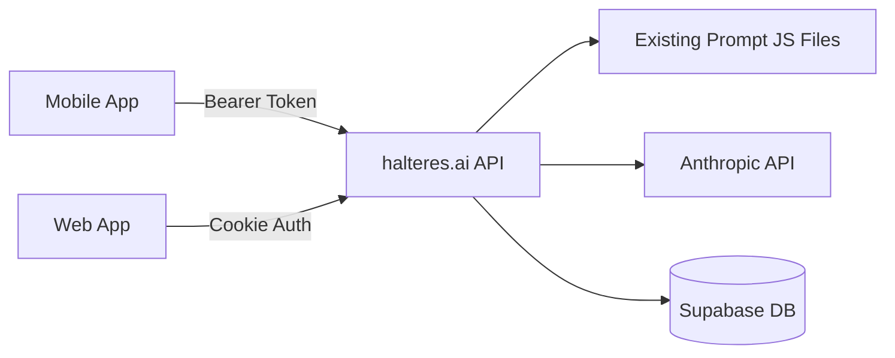

# Halteres Mobile Development Best Practices

This document outlines the core development standards and architectural patterns for the Halteres mobile application. All AI assistants (Claude Code, Codex, Warp, Cursor) and developers must follow these guidelines to ensure consistency and maintainability.

## Core Principles

### 1. TypeScript First
- **Strict Mode**: Always use TypeScript in strict mode
- **No `any` Types**: Avoid `any` types; use `unknown` or proper typing
- **Type Inference**: Leverage TypeScript's type inference where appropriate
- **Explicit Return Types**: Define return types for functions, especially public APIs
- **Interface over Type**: Prefer interfaces for object shapes, types for unions/primitives

### 2. Code Quality with Biome
- **Always Run Before Commit**: `npm run lint` and `npm run format`
- **No Disabled Rules**: Don't disable Biome rules without team consensus
- **Consistent Formatting**: 2-space indentation, no semicolons (Biome enforced)
- **Import Organization**: Let Biome handle import sorting

## Architecture Patterns

### Data Flow Architecture

#### ❌ NEVER DO THIS:
```typescript
// BAD: Direct API call in component
export function ProgramList() {
  const [programs, setPrograms] = useState([]);

  useEffect(() => {
    // NEVER call APIs directly in components
    fetch('/api/programs')
      .then(res => res.json())
      .then(setPrograms);
  }, []);
}
```

#### ✅ ALWAYS DO THIS:
```typescript
// GOOD: Use TanStack Query hooks
// hooks/usePrograms.ts
import { useQuery, useMutation } from '@tanstack/react-query'
import { apiClient } from '@/lib/api/client'

export function usePrograms() {
  return useQuery({
    queryKey: ['programs'],
    queryFn: () => apiClient.get('/api/programs'),
    staleTime: 5 * 60 * 1000, // 5 minutes
  })
}

// components/ProgramList.tsx
export function ProgramList() {
  const { data: programs, isLoading, error } = usePrograms()

  if (isLoading) return <Skeleton />
  if (error) return <ErrorState error={error} />

  return <ProgramGrid programs={programs} />
}
```

### Component Architecture

#### 1. Separation of Concerns
```typescript
// ✅ CORRECT STRUCTURE
// hooks/usePrograms.ts - Data fetching logic
// components/ProgramList.tsx - Presentation component
// components/forms/ProgramForm.tsx - Form logic
// lib/validations/program.schema.ts - Validation logic
// lib/api/programs.ts - API client methods
```

#### 2. Client Components Rules
- **Mark Appropriately**: Use `'use client'` only when needed (hooks, interactivity, browser APIs)
- **No Direct API Calls**: Never fetch data directly; always use TanStack Query hooks
- **State Management**: Use Zustand for global state, React state for local state
- **Form Handling**: Always use React Hook Form + Zod for forms

#### 3. Error Boundaries
```typescript
// Always wrap feature components with error boundaries
<ErrorBoundary fallback={<ErrorFallback />}>
  <ProgramFeature />
</ErrorBoundary>
```

## Supabase Integration

### Authentication Pattern
```typescript
// lib/supabase/client.ts
import { createClient } from '@supabase/supabase-js'
import { Preferences } from '@capacitor/preferences'

// Custom storage for Capacitor
const CapacitorStorage = {
  getItem: async (key: string) => {
    const { value } = await Preferences.get({ key })
    return value || null
  },
  setItem: async (key: string, value: string) => {
    await Preferences.set({ key, value })
  },
  removeItem: async (key: string) => {
    await Preferences.remove({ key })
  },
}

export const supabase = createClient(
  process.env.NEXT_PUBLIC_SUPABASE_URL!,
  process.env.NEXT_PUBLIC_SUPABASE_ANON_KEY!,
  {
    auth: {
      storage: CapacitorStorage,
      autoRefreshToken: true,
      persistSession: true,
      detectSessionInUrl: false,
    },
  }
)
```

### Database Query Pattern
```typescript
// ❌ NEVER: Direct Supabase calls in components
const { data } = await supabase.from('programs').select()

// ✅ ALWAYS: Use TanStack Query with Supabase
export function usePrograms() {
  return useQuery({
    queryKey: ['programs'],
    queryFn: async () => {
      const { data, error } = await supabase
        .from('programs')
        .select('*')
        .order('created_at', { ascending: false })

      if (error) throw error
      return data
    },
  })
}
```

## API Client Pattern

### Backend Architecture Decision

**IMPORTANT**: The mobile app connects to the EXISTING halteres.ai backend API. We do NOT migrate prompt files or AI logic to Edge Functions.



**Why this architecture:**
- ✅ Reuse all existing working prompt logic
- ✅ Single source of truth for AI generation
- ✅ No code duplication or migration needed
- ✅ Proven, tested production code
- ✅ Easier maintenance and updates

**What needs modification:**
- Add bearer token support to existing API routes
- Add CORS headers for mobile origin
- Keep all prompt JS files in existing location

### Bearer Token Authentication
```typescript
// lib/api/client.ts
const API_BASE = process.env.NEXT_PUBLIC_API_URL || 'https://halteres.ai'

export class ApiClient {
  private async getAuthHeader(): Promise<HeadersInit> {
    const { data: { session } } = await supabase.auth.getSession()

    if (!session?.access_token) {
      throw new Error('No authentication token')
    }

    return {
      'Authorization': `Bearer ${session.access_token}`,
      'Content-Type': 'application/json',
    }
  }

  async get<T>(endpoint: string): Promise<T> {
    const headers = await this.getAuthHeader()
    const response = await fetch(`${API_BASE}${endpoint}`, {
      method: 'GET',
      headers,
    })

    if (!response.ok) {
      throw new ApiError(response.status, await response.text())
    }

    return response.json()
  }

  async post<T>(endpoint: string, data?: unknown): Promise<T> {
    const headers = await this.getAuthHeader()
    const response = await fetch(`${API_BASE}${endpoint}`, {
      method: 'POST',
      headers,
      body: JSON.stringify(data),
    })

    if (!response.ok) {
      throw new ApiError(response.status, await response.text())
    }

    return response.json()
  }
}

export const apiClient = new ApiClient()
```

## Edge Functions Usage Policy

### When NOT to Use Edge Functions

**DO NOT USE Edge Functions for:**
- ❌ Migrating existing prompt JS files
- ❌ AI generation logic that already works in backend
- ❌ Anthropic API calls (keep in main backend)
- ❌ Any functionality that already exists in halteres.ai

### When to Use Edge Functions

**ONLY USE Edge Functions for:**
- ✅ Mobile-specific offline sync logic
- ✅ Push notification handlers
- ✅ Mobile-specific data transformations
- ✅ Features that don't exist in web app

```typescript
// Example: Mobile-specific sync function
// supabase/functions/mobile-sync/index.ts
import { serve } from 'https://deno.land/std@0.168.0/http/server.ts'

serve(async (req) => {
  // Handle mobile-specific offline sync
  const { workouts, completions } = await req.json()

  // Batch process offline data
  // This doesn't need prompt files

  return new Response(JSON.stringify({ synced: true }))
})
```

## Anthropic API Integration

### Claude API Pattern
```typescript
// lib/api/ai.ts
import { apiClient } from './client'

interface GenerateWorkoutParams {
  level: 'beginner' | 'intermediate' | 'advanced'
  focus: string[]
  duration: number
  equipment: string[]
}

export async function generateWorkout(params: GenerateWorkoutParams) {
  // Always route through your backend API
  // Never expose Anthropic API keys to the client
  return apiClient.post<WorkoutProgram>('/api/generate-program-anthropic', params)
}

// hooks/useAI.ts
export function useGenerateWorkout() {
  const queryClient = useQueryClient()

  return useMutation({
    mutationFn: generateWorkout,
    onSuccess: (data) => {
      // Invalidate and refetch programs list
      queryClient.invalidateQueries({ queryKey: ['programs'] })
      // Optionally, add the new program to the cache
      queryClient.setQueryData(['program', data.id], data)
    },
    // Long timeout for AI generation
    retry: 1,
    meta: {
      timeout: 300000, // 5 minutes
    },
  })
}

// components/GenerateWorkout.tsx
export function GenerateWorkout() {
  const generateMutation = useGenerateWorkout()
  const form = useForm<GenerateWorkoutParams>({
    resolver: zodResolver(generateWorkoutSchema),
  })

  const onSubmit = (data: GenerateWorkoutParams) => {
    generateMutation.mutate(data, {
      onSuccess: (workout) => {
        router.push(`/programs/${workout.id}`)
      },
    })
  }

  return (
    <Form {...form}>
      {/* Form fields */}
      <Button
        type="submit"
        disabled={generateMutation.isPending}
      >
        {generateMutation.isPending ? 'Generating...' : 'Generate Workout'}
      </Button>
    </Form>
  )
}
```

## Mobile-First Patterns

### Responsive Design
```typescript
// Always use mobile-first approach
<div className="p-4 md:p-6 lg:p-8">
  <div className="grid grid-cols-1 md:grid-cols-2 lg:grid-cols-3 gap-4">
    {/* Content */}
  </div>
</div>
```

### Touch Interactions
```typescript
// Use Framer Motion for gestures
import { motion } from 'framer-motion'

<motion.div
  drag="x"
  dragConstraints={{ left: -100, right: 0 }}
  onDragEnd={(e, { offset }) => {
    if (offset.x < -50) {
      handleDelete()
    }
  }}
>
  {/* Swipeable content */}
</motion.div>
```

### Platform-Specific Code
```typescript
// lib/utils/platform.ts
import { Capacitor } from '@capacitor/core'

export const isNative = Capacitor.isNativePlatform()
export const isIOS = Capacitor.getPlatform() === 'ios'
export const isAndroid = Capacitor.getPlatform() === 'android'
export const isWeb = Capacitor.getPlatform() === 'web'

// Usage in components
{isNative && <NativeOnlyFeature />}
{isIOS && <IOSSpecificUI />}
```

## Form Validation Pattern

### Always Use React Hook Form + Zod
```typescript
// lib/validations/workout.schema.ts
import { z } from 'zod'

export const workoutSchema = z.object({
  name: z.string().min(1, 'Name is required').max(100),
  exercises: z.array(z.object({
    name: z.string(),
    sets: z.number().min(1).max(10),
    reps: z.number().min(1).max(100),
    weight: z.number().optional(),
  })).min(1, 'At least one exercise required'),
})

export type WorkoutFormData = z.infer<typeof workoutSchema>

// components/forms/WorkoutForm.tsx
import { useForm } from 'react-hook-form'
import { zodResolver } from '@hookform/resolvers/zod'

export function WorkoutForm({ onSubmit }: Props) {
  const form = useForm<WorkoutFormData>({
    resolver: zodResolver(workoutSchema),
    defaultValues: {
      name: '',
      exercises: [{ name: '', sets: 3, reps: 10 }],
    },
  })

  return (
    <Form {...form}>
      <form onSubmit={form.handleSubmit(onSubmit)}>
        {/* Form fields */}
      </form>
    </Form>
  )
}
```

## State Management Rules

### Global State (Zustand)
```typescript
// stores/userStore.ts
import { create } from 'zustand'
import { persist } from 'zustand/middleware'

interface UserState {
  user: User | null
  preferences: UserPreferences
  setUser: (user: User | null) => void
  updatePreferences: (prefs: Partial<UserPreferences>) => void
}

export const useUserStore = create<UserState>()(
  persist(
    (set) => ({
      user: null,
      preferences: defaultPreferences,
      setUser: (user) => set({ user }),
      updatePreferences: (prefs) =>
        set((state) => ({
          preferences: { ...state.preferences, ...prefs },
        })),
    }),
    {
      name: 'user-storage',
    }
  )
)
```

### Server State (TanStack Query)
- **Always use TanStack Query** for server state
- **Never store server data in Zustand**
- **Use proper cache invalidation**
- **Implement optimistic updates** for better UX

## Testing Requirements

### Component Testing
```typescript
// __tests__/components/ProgramList.test.tsx
import { render, screen } from '@testing-library/react'
import { QueryClient, QueryClientProvider } from '@tanstack/react-query'

const createTestQueryClient = () =>
  new QueryClient({
    defaultOptions: {
      queries: { retry: false },
      mutations: { retry: false },
    },
  })

describe('ProgramList', () => {
  it('renders loading state', () => {
    render(
      <QueryClientProvider client={createTestQueryClient()}>
        <ProgramList />
      </QueryClientProvider>
    )

    expect(screen.getByTestId('skeleton')).toBeInTheDocument()
  })
})
```

## Performance Guidelines

### 1. Code Splitting
```typescript
// Lazy load heavy components
const GenerateWorkout = lazy(() => import('./GenerateWorkout'))

// Use Suspense boundaries
<Suspense fallback={<Skeleton />}>
  <GenerateWorkout />
</Suspense>
```

### 2. Image Optimization
```typescript
// Always use Next.js Image component
import Image from 'next/image'

<Image
  src={imageUrl}
  alt="Workout"
  width={400}
  height={300}
  loading="lazy"
  placeholder="blur"
/>
```

### 3. Memoization
```typescript
// Memoize expensive computations
const expensiveValue = useMemo(() =>
  calculateComplexValue(data), [data]
)

// Memoize callbacks passed to children
const handleClick = useCallback(() => {
  // handle click
}, [dependencies])
```

## Security Guidelines

### 1. API Keys
- **NEVER expose API keys** in client code
- **Use environment variables** with `NEXT_PUBLIC_` prefix only for public keys
- **Route all sensitive API calls** through your backend

### 2. Authentication
- **Always validate tokens** on the backend
- **Use Capacitor Preferences** for secure storage on mobile
- **Implement token refresh** logic

### 3. Data Validation
- **Validate all user input** with Zod
- **Sanitize data** before sending to APIs
- **Never trust client-side validation** alone

## File Naming Conventions

```
components/
  ProgramList.tsx        # PascalCase for components
  forms/
    WorkoutForm.tsx      # Descriptive names

hooks/
  usePrograms.ts         # use prefix for hooks
  useAuth.ts

lib/
  api/
    client.ts            # lowercase for utilities
    programs.ts
  validations/
    workout.schema.ts    # .schema suffix for Zod schemas

stores/
  userStore.ts           # camelCase with Store suffix
```

## Git Commit Conventions

```bash
feat: Add workout generation with Claude API
fix: Resolve authentication token refresh issue
refactor: Extract form validation to separate hook
docs: Update API integration patterns
test: Add coverage for program mutations
style: Format code with Biome
chore: Update dependencies
```

## Development Workflow

1. **Before Starting Work**
   - Pull latest changes
   - Check for schema updates in Supabase
   - Review any new patterns in this document

2. **During Development**
   - Run `npm run dev` with Turbopack
   - Use React Query DevTools for debugging
   - Test on both iOS and Android simulators

3. **Before Committing**
   - Run `npm run lint` and fix issues
   - Run `npm run format` to ensure consistency
   - Run `npm run build` to catch build errors
   - Write meaningful commit messages

4. **Code Review Checklist**
   - ✅ No direct API calls in components
   - ✅ All forms use React Hook Form + Zod
   - ✅ Proper error handling with boundaries
   - ✅ Mobile-first responsive design
   - ✅ TypeScript strict mode compliance
   - ✅ Biome linting passes
   - ✅ TanStack Query for all server state

## Common Pitfalls to Avoid

1. **Direct API Calls**: Never call APIs directly from components
2. **Storing Server State in Zustand**: Use TanStack Query instead
3. **Missing Error Boundaries**: Always wrap features with error boundaries
4. **Ignoring Platform Differences**: Test on both iOS and Android
5. **Client-Side API Keys**: Never expose sensitive keys to the client
6. **Synchronous Storage**: Use async Capacitor Preferences
7. **Missing Loading States**: Always handle loading/error states
8. **Unoptimized Images**: Use Next.js Image component
9. **Missing Form Validation**: Always validate with Zod
10. **Direct Supabase Calls in Components**: Always abstract through hooks

## Questions or Updates?

This document is living documentation. If you encounter patterns not covered here or have suggestions for improvements, please update this document and notify the team.