# Halteres Database Schema Documentation

## Database Entity Relationship Diagram

```mermaid
erDiagram
    users ||--o{ entities : "owns"
    users ||--|| profiles : "has"
    entities ||--o{ programs : "has"
    entities ||--o{ program_workouts : "assigned"
    entities ||--o{ workout_schedule : "scheduled"
    entities ||--o{ ai_recommendations : "receives"
    programs ||--o{ program_workouts : "contains"
    programs ||--o{ workout_schedule : "schedules"
    programs ||--o{ ai_recommendations : "generates"
    program_workouts ||--o{ workout_schedule : "scheduled as"
    external_workouts ||--o{ program_workouts : "references"

    users {
        uuid id PK
        string email
        timestamp created_at
    }

    profiles {
        uuid id PK "FK to users.id"
        text full_name
        text email
        text avatar_url
        text stripe_customer_id UK
        text stripe_subscription_id UK
        text stripe_price_id
        enum subscription_status
        enum subscription_plan
        timestamp trial_start_date
        timestamp trial_end_date
        integer generations_remaining
        integer generations_today
        date last_generation_date
        boolean is_active
        timestamp updated_at
    }

    entities {
        uuid id PK
        uuid user_id FK
        text name
        enum type "CLIENT or CLASS"
        jsonb description
        numeric bench_1rm
        numeric deadlift_1rm
        numeric squat_1rm
        interval mile_time
        text gender
        integer age
        integer height_cm
        numeric weight_kg
        numeric years_of_experience
        text workout_experience_type
        integer recovery_score
        jsonb preferred_training_days
        jsonb injury_history
        timestamp deleted_at "soft delete"
        timestamp created_at
        timestamp updated_at
    }

    programs {
        uuid id PK
        uuid entity_id FK
        text name
        text description
        integer duration_weeks
        text focus_area
        text goal
        text difficulty
        text training_methodology
        text reference_input
        jsonb session_details
        jsonb program_overview
        jsonb workout_format
        jsonb gym_details
        jsonb generated_program
        jsonb calendar_data
        jsonb periodization
        timestamp created_at
        timestamp updated_at
    }

    program_workouts {
        uuid id PK
        uuid program_id FK
        uuid entity_id FK
        bigint external_workout_id FK
        text title
        text body
        text workout_type
        text difficulty
        jsonb tags
        timestamp scheduled_date
        boolean completed
        timestamp completed_at
        text notes
        boolean is_reference
        timestamp created_at
        timestamp updated_at
    }

    workout_schedule {
        uuid id PK
        uuid program_id FK
        uuid entity_id FK
        uuid workout_id FK
        timestamp scheduled_date
        text notes
        timestamp created_at
        timestamp updated_at
    }

    ai_recommendations {
        uuid id PK
        uuid program_id FK
        uuid entity_id FK
        text recommendation_type
        jsonb recommendation_data
        timestamp generated_at
    }

    external_workouts {
        bigint id PK
        text title
        text body
        vector embedding_part1
        vector embedding_part2
        jsonb tags
        text difficulty
        timestamp created_at
    }

    external_workouts_new {
        bigint id PK
        text title
        text body
        vector embedding
        jsonb tags
        text difficulty
        timestamp created_at
    }
```



## Table Descriptions

### Core User Tables

#### **profiles**
- Extends Supabase auth.users with application-specific user data
- Manages subscription status and payment information via Stripe
- Tracks AI generation limits and usage
- Soft-delete support with `is_active` flag

#### **entities**
- Represents either individual clients (`CLIENT`) or group classes (`CLASS`)
- Stores fitness metrics, personal information, and training preferences
- Supports soft deletion with `deleted_at` timestamp
- Links to user account via `user_id`

### Program Management Tables

#### **programs**
- AI-generated or manually created training programs
- Contains structured workout data in JSONB fields
- Supports various training methodologies and goals
- Links to specific entity (client/class)

#### **program_workouts**
- Individual workout sessions within a program
- Can reference external workout templates
- Tracks completion status and timestamps
- Supports workout scheduling and notes

#### **workout_schedule**
- Calendar scheduling for workouts
- Links programs, entities, and specific workouts
- Allows for flexible scheduling with notes

### AI and Content Tables

#### **ai_recommendations**
- Stores AI-generated recommendations for programs
- Types include: exercise swaps, deload suggestions, intensity adjustments
- Links to both programs and entities

#### **external_workouts** / **external_workouts_new**
- Library of workout templates with vector embeddings
- Used for similarity search and workout recommendations
- Two versions: legacy (split embeddings) and new (single embedding)
- Searchable by tags and difficulty level

## Key Relationships

1. **User → Entity**: One-to-many relationship where users can have multiple clients/classes
2. **Entity → Program**: One-to-many relationship for multiple training programs per entity
3. **Program → Workouts**: One-to-many relationship for workouts within a program
4. **Workouts → Schedule**: Flexible scheduling system allowing workout reassignment

## Database Features

### Enumerations
- `entity_type`: CLIENT, CLASS
- `subscription_status_enum`: trialing, active, canceled, past_due, incomplete, incomplete_expired
- `subscription_plan_enum`: monthly, quarterly, annual, daily

### Indexing Strategy
- User lookups: `idx_entities_user_id`
- Soft delete queries: `idx_entities_deleted_at`
- Stripe integrations: unique indexes on customer and subscription IDs
- Performance optimization: indexes on foreign keys and commonly queried fields

### Security Features
- Row Level Security (RLS) enabled on all tables
- Foreign key constraints with appropriate CASCADE rules
- User isolation through `auth.uid()` checks

## Data Flow for Mobile App

### Authentication Flow
```
1. User signs up/in via Supabase Auth
2. Profile automatically created via trigger
3. Trial period initialized with generation limits
```

### Program Generation Flow
```
1. User selects entity (client/class)
2. App queries entity fitness metrics
3. AI generates program using Anthropic API
4. Program stored with workouts
5. Schedule created for calendar view
```

### Workout Tracking Flow
```
1. User views scheduled workout
2. Marks workout as completed
3. Completion timestamp recorded
4. Progress tracked for analytics
```

## Mobile App Considerations

### Offline Support
- Cache critical data: profiles, entities, active programs
- Queue workout completions for sync
- Store recent workouts locally

### Performance Optimization
- Use indexes for common queries
- Implement pagination for workout lists
- Cache vector search results

### Data Sync Strategy
- Real-time subscriptions for profile updates
- Batch sync for workout completions
- Incremental sync for program updates